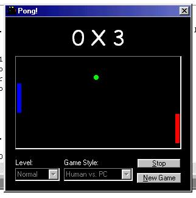

<div align="center">

## Pong\! without DirectX


</div>

### Description

Teach to use a basic AI and Joystick. Please Vote
 
### More Info
 
Teach to use a basic AI, to implement Joystick, and BitBlt API function . Please Vote


<span>             |<span>
---                |---
**Submitted On**   |2000-11-05 19:11:58
**By**             |[N/A](https://github.com/Planet-Source-Code/PSCIndex/blob/master/ByAuthor/empty.md)
**Level**          |Intermediate
**User Rating**    |4.3 (13 globes from 3 users)
**Compatibility**  |VB 6\.0
**Category**       |[Games](https://github.com/Planet-Source-Code/PSCIndex/blob/master/ByCategory/games__1-38.md)
**World**          |[Visual Basic](https://github.com/Planet-Source-Code/PSCIndex/blob/master/ByWorld/visual-basic.md)
**Archive File**   |[CODE\_UPLOAD113251152000\.zip](https://github.com/Planet-Source-Code/pong-without-directx__1-12552/archive/master.zip)

### API Declarations

```
BitBlt
and more.....
```


